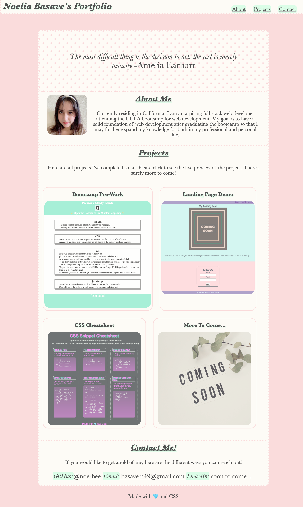

# My-Portfolio-challenge

## Description

- The purpose of this this challenge is to create my own portfolio to share to future employers the projects that I have created. While this portfolio project is technically for a grade, I saw this as an opportunity to practice and learn about the complexity of how html and css work together to create a website. Visually, my portfolio looks simple but it took quite a few sections to ultimately get it to look the way it does. I learned a lot by making this portfolio, especially as I was finally able to practice using methods like the Flexbox. This portfolio probably won't stay as it is now, since I will likely add or change the layout as I advance further into the bootcamp and advance my skills.

## Installation

N/A

## Usage
  GitHub page: https://noe-bee.github.io/my-portfolio/   
  GitHub repository: https://github.com/noe-bee/my-portfolio

 

## Credits

-clearfix hack (css line 136) courtesy of w3 schools! https://www.w3schools.com/cssref/pr_class_float.php   
-smooth scroll behavior (css line 14) courtesy of stack overflow https://stackoverflow.com/questions/24739126/scroll-to-a-specific-element-using-html

## License

Refer to the license on the repository.

---
